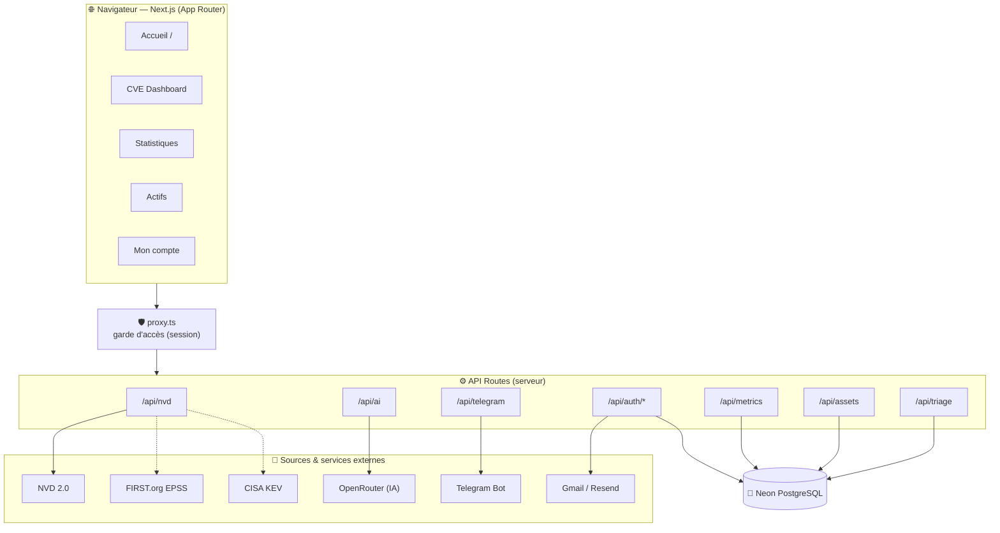
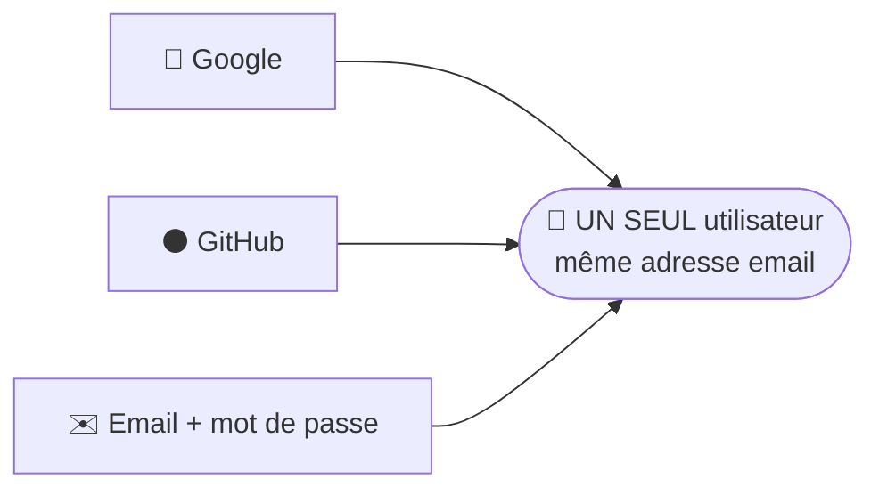
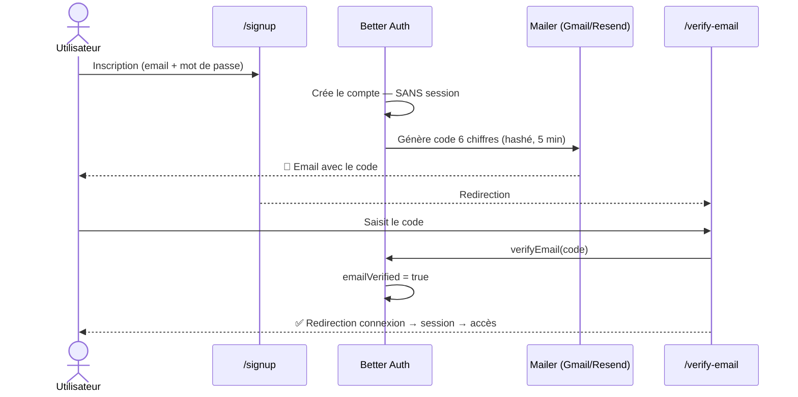
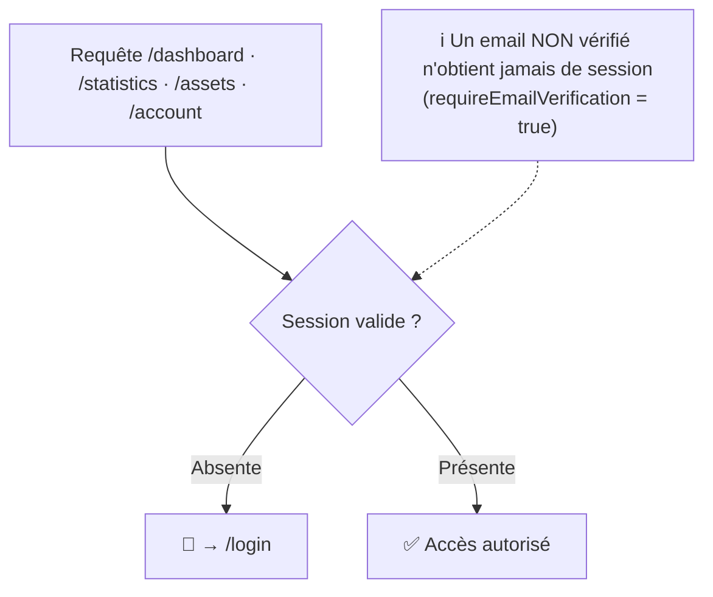
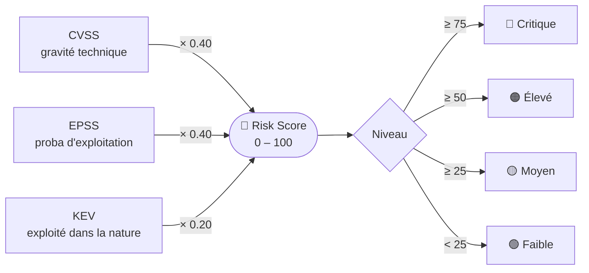
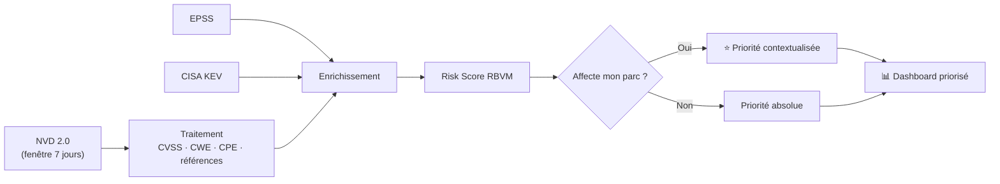
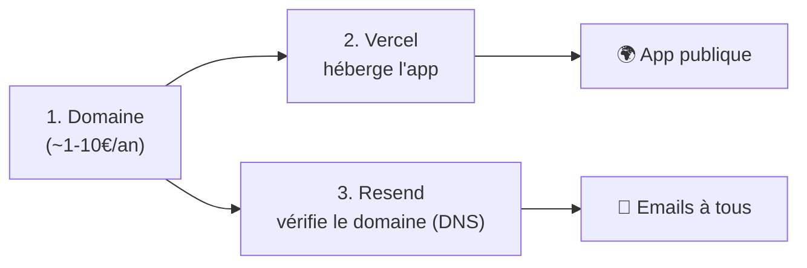

<div align="center">


# 🐙 OCTUPUS-VOC

### *Rise from the deep. Crush every threat.*

**Plateforme de Threat Intelligence & de priorisation des vulnérabilités (RBVM)** — un véritable *Vulnerability Operations Center* qui surveille les CVE, les enrichit (CVSS · EPSS · CISA KEV · CWE · CAPEC · ATT&CK) et les **priorise par le risque réel**, contextualisé à ton parc.


</div>

---

## 📑 Sommaire

- [Vue d'ensemble](#-vue-densemble)
- [Architecture](#-architecture)
- [Authentification](#-authentification-better-auth)
- [Risk Score RBVM](#-le-risk-score-rbvm)
- [Pipeline de données](#-pipeline-de-données)
- [Fonctionnalités détaillées](#-fonctionnalités-détaillées)
- [Routes API](#-routes-api)
- [Base de données](#-base-de-données)
- [Sources de données](#-sources-de-données)
- [Stack technique](#-stack-technique)
- [Démarrage rapide](#-démarrage-rapide)
- [Variables d'environnement](#-variables-denvironnement)
- [Tests & qualité](#-tests--qualité)
- [Déploiement](#-déploiement)
- [Structure du projet](#-structure-du-projet)
- [Sécurité](#-sécurité)
- [Feuille de route](#-feuille-de-route)
- [Licence](#-licence)

---

## 🧭 Vue d'ensemble

OCTUPUS-VOC répond à la question centrale d'un analyste : parmi les centaines de CVE publiées chaque semaine, **laquelle traiter en premier ?**

La réponse vient du **Risk Score RBVM**, qui fusionne la gravité technique (**CVSS**), la probabilité d'exploitation (**EPSS**) et l'exploitation confirmée dans la nature (**CISA KEV**) — le tout **contextualisé** à ton inventaire d'actifs. Une faille sur ton serveur de production critique remonte plus haut qu'une faille sur un produit que tu n'as pas.

**Pour qui ?** Analystes VOC/SOC, blue teams, DevSecOps, et toute équipe qui doit **prioriser la remédiation** sans se noyer dans le flux CVE.

---

## 🏗️ Architecture



- **Frontend** : Next.js 16 (Turbopack) · React 19 · TypeScript · Tailwind v4 · shadcn/ui — pages client qui consomment les Routes API.
- **Serveur** : Routes API Next (proxys sécurisés + persistance) + `proxy.ts` (garde d'accès) + Better Auth.
- **Base de données** : Neon PostgreSQL (auth, triage, actifs, métriques, déduplication des alertes).
- **Aucune clé secrète côté navigateur** : NVD, OpenRouter, Telegram et l'email passent tous par le serveur.

---

## 🔐 Authentification (Better Auth)

### Un seul utilisateur par email

Quelle que soit la méthode de connexion, **le même email = le même compte** (account linking). Jamais de doublon.



### Vérification d'email par code OTP

Inscription en **mode strict** : aucune session tant que l'email n'est pas vérifié par un **code à 6 chiffres**.



### Garde d'accès (proxy)



### Paramètres de sécurité

| Aspect | Valeur |
|---|---|
| **Providers** | Email/mot de passe · Google OAuth · GitHub OAuth |
| **Account linking** | `trustedProviders: [google, github, email-password]` |
| **Session** | expire **7 jours**, rotation toutes les **24 h**, cache cookie signé **5 min** |
| **OTP** | **6 chiffres**, expire **5 min**, **3 essais** max, **hashé** en base |
| **Rate limiting** | 100 req / 60 s (fenêtre glissante) |
| **Cookies** | `HttpOnly` + `SameSite=Lax` + `Secure` (prod) |
| **Protocoles** | CSRF, state OAuth, **PKCE** natifs · aligné OWASP |

---

## 🧮 Le Risk Score RBVM

Les trois signaux sont **normalisés sur 0–100** avant pondération (sinon l'EPSS, sur 0–1, pèserait quasi rien face au CVSS sur 0–10) :



`Risk = CVSS_norm × 0.40 + EPSS_norm × 0.40 + KEV_boost × 0.20`

### Niveaux & SLA de remédiation

| Niveau | Risk Score | SLA | Couleur |
|---|:---:|:---:|:---:|
| **Critique** | ≥ 75 | 24 h | 🔴 |
| **Élevé** | ≥ 50 | 72 h | 🟠 |
| **Moyen** | ≥ 25 | 7 jours | 🟡 |
| **Faible** | < 25 | 30 jours | 🟢 |

> Une CVE présente au **CISA KEV** force un SLA de **24 h**, quel que soit son niveau.

---

## 🔄 Pipeline de données



---

## ✨ Fonctionnalités détaillées

### 🔎 Core CVE
- Flux temps réel depuis **NVD 2.0** (fenêtre 7 jours, rafraîchissement auto non destructif toutes les 60 s).
- **CWE** multiples par CVE, avec dictionnaire explicatif FR.
- **EPSS** (probabilité d'exploitation à 30 jours) et **CISA KEV** (exploitation confirmée).
- Recherche + filtres : mot-clé, sévérité, vecteur d'attaque, CWE, Risk Score min, KEV, exploit.

### 🧠 Threat Intelligence
- Badge **Exploit disponible 💥**, advisories & références NVD taguées (correctif, mitigation, exploit).
- **CAPEC** (patterns d'attaque) et **MITRE ATT&CK** (techniques dérivées des CWE — *indicatif*).
- Produits & éditeurs affectés (extraits des CPE), **graphe de menaces** (Cytoscape).

### 📊 Analytics
- Distributions **CVSS** & **EPSS**, répartition par sévérité.
- **Top 10** CWE / éditeurs / produits, CVE par jour et par année.

### 🎯 VOC opérationnel
- **Triage** par CVE : `Nouveau · En cours · Traité · Faux positif · Risque accepté` (persisté).
- **Inventaire d'actifs par compte** → risque **contextualisé** « ⭐ Mon parc ».
- **Métriques** VOC (triage, actifs surveillés, alertes envoyées), export CSV/JSON.

### 🤖 Automatisation
- **Alertes Telegram** automatiques des CVE High/Critical (dédupliquées côté serveur).
- **Agent IA** (OpenRouter) : analyse d'une CVE (résumé, exploitation, impact, remédiation).

### 👤 Compte & sécurité
- Providers liés (Google/GitHub/email), **lier/délier**, **sessions actives** (révocation), dernière connexion, suppression de compte.

---

## 🌐 Routes API

| Route | Méthodes | Auth | Rôle |
|---|---|:---:|---|
| `/api/nvd` | GET | 🔒 | Proxy NVD 2.0 (masque la clé, évite le CORS) |
| `/api/triage` | GET · POST | 🔒 | Statuts de triage des CVE |
| `/api/assets` | GET · POST · DELETE | 🔒 | Inventaire d'actifs (scopé par `user_id`) |
| `/api/metrics` | GET | 🔒 | Métriques VOC agrégées |
| `/api/ai` | POST | 🔒 | Analyse IA d'une CVE (OpenRouter) |
| `/api/telegram` | GET · POST | 🔒 | Déduplication + envoi d'alertes |
| `/api/auth/[...all]` | * | 🌐 | Better Auth (login, OTP, OAuth, sessions) |

🔒 = session requise (`requireUser()` → 401 sinon) · 🌐 = public.

---

## 🗄️ Base de données

Tables créées automatiquement (`lib/db.ts`) + schéma Better Auth :

| Table | Contenu |
|---|---|
| `user` · `session` · `account` · `verification` | Auth (Better Auth) — utilisateurs, sessions, providers liés, tokens/OTP |
| `triage` | `cve_id`, `status`, `note`, `assignee`, `updated_at` |
| `assets` | `id`, **`user_id`**, `name`, `vendor`, `product`, `criticality`, `owner` |
| `alerts_sent` | `cve_id`, `sent_at` — déduplication des alertes Telegram |

---

## 🔌 Sources de données

| Source | Usage | Clé requise |
|---|---|:---:|
| **NVD 2.0** | CVE, CVSS, CWE, CPE, références | serveur |
| **FIRST.org EPSS** | probabilité d'exploitation | non |
| **CISA KEV** | failles activement exploitées | non |
| **MITRE CWE / CAPEC / ATT&CK** | mapping faiblesses → attaques | non (curé) |
| **OpenRouter** | agent IA | serveur |
| **Telegram Bot API** | alertes | serveur |
| **Gmail / Resend** | emails OTP | serveur |

---

## 🛠️ Stack technique

- **Next.js 16** (Turbopack) · **React 19** · **TypeScript** (strict) · **Tailwind v4** · **shadcn/ui** (Base UI)
- **Better Auth 1.6** (+ `@better-auth/infra` dash, plugin `emailOTP`)
- **Neon PostgreSQL** (`pg` + `@neondatabase/serverless`)
- **Recharts** (graphes) · **Cytoscape** (graphe de menaces) · **Three.js** (hero 3D)
- **nodemailer** (Gmail SMTP) / **Resend** (email) · **Telegram Bot API** · **OpenRouter**
- Runtime **Bun**

---

## 🚀 Démarrage rapide

### 1. Prérequis

[Bun](https://bun.sh) installé et une base **Neon PostgreSQL**.

### 2. Installation

```bash
bun install
```

### 3. Configuration

Crée un fichier `.env.local` (voir [Variables d'environnement](#-variables-denvironnement)).

### 4. Lancer

```bash
bun dev            # développement (http://localhost:3000)
bun run build      # build de production
bun start          # serveur de production
```

---

## 🔑 Variables d'environnement

`.env.local` (**ignoré par Git** — ne committe jamais de secrets) :

| Variable | Requis | Description |
|---|:---:|---|
| `DATABASE_URL` | ✅ | Chaîne de connexion Neon PostgreSQL |
| `BETTER_AUTH_SECRET` | ✅ | Clé secrète aléatoire (signature des sessions) |
| `BETTER_AUTH_URL` | ✅ | URL de base (`http://localhost:3000` en dev) |
| `BETTER_AUTH_API_KEY` | ⚪ | Clé du dashboard Better Auth hébergé |
| `GITHUB_CLIENT_ID` / `GITHUB_CLIENT_SECRET` | ⚪ | OAuth GitHub |
| `GOOGLE_CLIENT_ID` / `GOOGLE_CLIENT_SECRET` | ⚪ | OAuth Google |
| `EMAIL_PROVIDER` | ✅ | `gmail` (gratuit) ou `resend` |
| `GMAIL_USER` / `GMAIL_APP_PASSWORD` | ⚪* | Compte Gmail + mot de passe d'application (16 car.) |
| `RESEND_API_KEY` / `RESEND_FROM` | ⚪* | Clé Resend + expéditeur (domaine vérifié) |
| `NVD_API_KEY` | ⚪ | Clé NVD (débit 50 req/30 s au lieu de 5) |
| `OPENROUTER_API_KEY` / `OPENROUTER_MODEL` | ⚪ | Agent IA |
| `TELEGRAM_BOT_TOKEN` / `TELEGRAM_CHAT_ID` | ⚪ | Alertes Telegram |

*\* selon `EMAIL_PROVIDER` : au moins un fournisseur d'email doit être configuré pour l'envoi des codes OTP.*

---

## 🧪 Tests & qualité

```bash
bun test           # tests d'authentification (bun:test, base Neon réelle)
bun run typecheck  # tsc --noEmit (0 erreur)
bun run lint       # eslint
```

Les tests couvrent : **account linking**, **mode strict** (inscription sans session, connexion bloquée tant que non vérifié, OK après vérification), rate limiting, rotation de session, garde des routes API.

---

## ☁️ Déploiement



1. **Vercel** : importe le repo, ajoute les variables d'environnement (mêmes clés que `.env.local`, mais en **production**).
2. Passe `BETTER_AUTH_URL` sur ton domaine HTTPS et mets à jour les **redirect URIs** OAuth (`/api/auth/callback/{google|github}`).
3. **Email à tous** : `EMAIL_PROVIDER=gmail` fonctionne immédiatement (~500/jour) ; pour du volume/pro, vérifie un domaine sur **Resend** puis `EMAIL_PROVIDER=resend`.
4. En prod, `NODE_ENV=production` active automatiquement les cookies `Secure`.

> Le sous-domaine gratuit `*.vercel.app` sert à **héberger**, pas à envoyer des emails (pas de contrôle DNS pour Resend).

---

## 📁 Structure du projet

```text
next-app/
├── app/
│   ├── page.tsx              # Accueil (hero 3D)
│   ├── dashboard/            # CVE Dashboard (RBVM, heatmap, feed, triage)
│   ├── statistics/           # Analytics
│   ├── assets/               # Inventaire d'actifs (par compte)
│   ├── account/              # Profil : providers, sessions, sécurité
│   ├── login · signup · verify-email/
│   └── api/                  # nvd · triage · assets · metrics · ai · telegram · auth
├── lib/
│   ├── auth.ts               # Config Better Auth (linking, OTP, sécurité, sessions)
│   ├── auth-client.ts        # Client Better Auth
│   ├── auth-errors.ts        # Messages d'erreur FR centralisés
│   ├── api-auth.ts           # Garde requireUser() pour les routes API
│   ├── mailer.ts             # Envoi OTP (Gmail SMTP / Resend)
│   ├── db.ts                 # Neon (triage · assets · alerts_sent)
│   ├── risk-engine.ts        # Moteur RBVM
│   ├── data.ts               # Fetch + enrichissement NVD/EPSS/KEV
│   └── threat-map.ts         # CWE → CAPEC → ATT&CK
├── components/               # navbar · cve-detail-dialog · threat-graph · telegram-qr …
├── proxy.ts                  # Garde d'accès (redirige les invités)
└── tests/auth.test.ts        # Tests bun:test
```

---

## 🔒 Sécurité

- **Auth serveur** : chaque route API sensible passe par `requireUser()` (401 sinon) — la **donnée** est protégée, pas seulement la page.
- **Isolation par compte** : les actifs sont scopés par `user_id` (un compte ne voit jamais ceux d'un autre).
- **Mode strict** : aucune session tant que l'email n'est pas vérifié → accès impossible sans code.
- **OWASP** : cookies sécurisés, CSRF, state OAuth, PKCE, rate limiting, sessions rotées, OTP hashé.
- **Secrets** : uniquement dans `.env.local` (gitignore) ; jamais exposés au navigateur.

---

## 🗺️ Feuille de route

- [ ] Domaine vérifié sur Resend (envoi pro à tous)
- [ ] RBAC (rôles analyste / manager)
- [ ] Métriques opérationnelles (MTTR, conformité SLA, aging, couverture)
- [ ] Ingestion de scanners (Trivy / OpenVAS)
- [ ] Connecteurs tickets (Jira / ServiceNow)

---

## 📄 Licence

**Propriétaire — Tous droits réservés © 2026 Tbini Mustapha Amin.**

Aucune utilisation, installation, copie, modification, distribution, exécution
ni opération (CRUD) sur ce projet ou ses données n'est autorisée **sans l'accord
écrit préalable de l'auteur**. Voir le fichier [LICENSE](LICENSE) pour les termes complets.

---

<div align="center">

**OCTUPUS-VOC** — construit pour prioriser ce qui compte vraiment. 🐙

</div>
