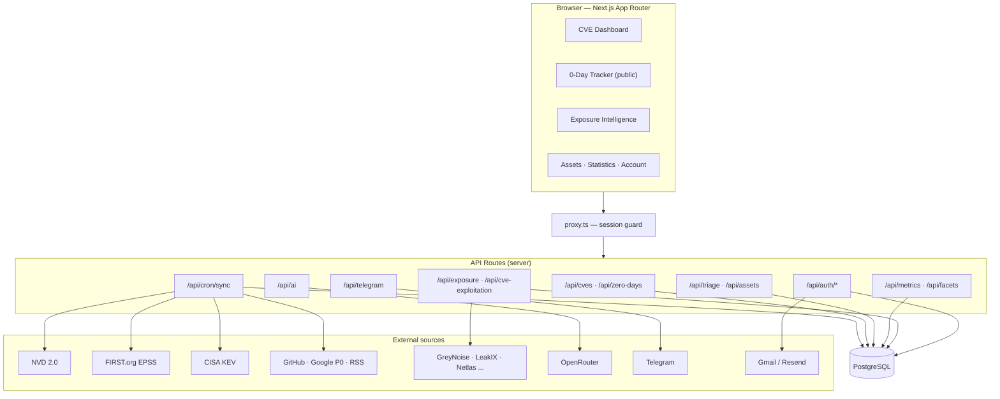
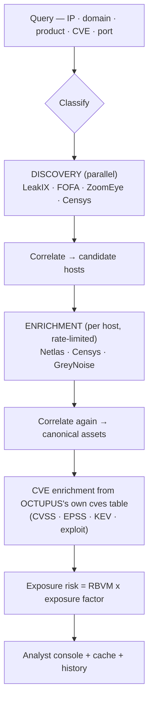
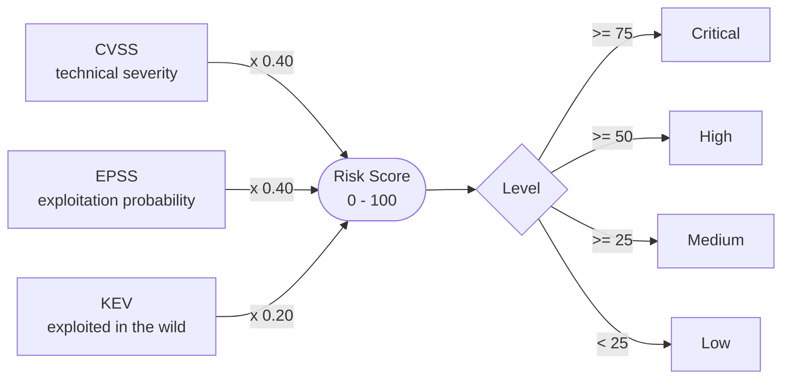

<div align="center">


# 🐙 OCTUPUS-VOC

### *Rise from the deep. Crush every threat.*

**A Vulnerability Operations Center** combining **Vulnerability Intelligence + RBVM + EASM / Exposure Intelligence + Threat Intelligence** — it tracks CVEs and pre-disclosure 0-days, enriches them (CVSS · EPSS · CISA KEV · CWE · CAPEC · ATT&CK), discovers and correlates your **external attack surface** across six exposure providers, and ranks everything by **real exploitation risk**.


</div>

---

## Contents

- [What it does](#what-it-does)
- [Quick start](#quick-start)
- [Configuration](#configuration)
- [Architecture](#architecture)
- [Exposure Intelligence (EASM)](#exposure-intelligence-easm)
- [Periodic exposure monitoring](#periodic-exposure-monitoring)
- [Exposure → CVE → RBVM → SOC alert](#exposure--cve--rbvm--soc-alert)
- [Multi-user tenancy](#multi-user-tenancy)
- [SOC workflow](#soc-workflow---alerts-telegram-ticketing)
- [Exposure Intelligence Graph](#exposure-intelligence-graph)
- [The risk score](#the-risk-score)
- [Features](#features)
- [API routes](#api-routes)
- [Database](#database)
- [Deployment](#deployment)
- [Testing & quality](#testing--quality)
- [Project structure](#project-structure)
- [Troubleshooting](#troubleshooting)
- [Contact](#contact)
- [License](#license)

---

## What it does

Hundreds of CVEs are published every week. OCTUPUS-VOC answers the only question that matters to an analyst: **which one do I fix first?**

It combines technical severity (**CVSS**), probability of exploitation (**EPSS**), and confirmed in-the-wild exploitation (**CISA KEV**) into a single 0–100 risk score — then weights it against your own asset inventory, so a flaw in your production stack outranks a flaw in software you don't run.

It also tracks **0-days before they become CVEs**, merging six independent sources (reserved NVD entries, KEV pre-publication, GitHub advisories without a CVE, Google Project Zero, defend.network, and filtered security news).

**Who it's for:** VOC/SOC analysts, blue teams, DevSecOps, and any team that has to triage vulnerabilities without drowning in the feed.

---

## Quick start

**Prerequisites:** [Bun](https://bun.sh) and a PostgreSQL database ([Neon](https://neon.tech) has a free tier).

```bash
# 1. Install dependencies
bun install

# 2. Create your config
cp .env.example .env.local

# 3. Fill in the REQUIRED section of .env.local
#    (need a session secret?  bun run doctor:secret)

# 4. Verify everything is wired up correctly
bun run doctor

# 5. Start
bun dev
```

`bun run doctor` validates your configuration before you start: it connects to the database, checks every required value, and lists each optional feature as on or off with a link to enable it. **If it reports a blocking issue, fix that first** — the app will not work correctly otherwise.

The database schema is created automatically on first run. There is no migration step.

> **First data:** the CVE table starts empty. Populate it by running a sync (`bun run scripts/sync-zero-days.ts`) or by setting up the [scheduled sync](#scheduled-sync).

---

## Configuration

Everything lives in `.env.local`. Full annotated reference: [`.env.example`](.env.example).

### Required

| Variable | What it's for |
|---|---|
| `DATABASE_URL` | PostgreSQL connection string |
| `BETTER_AUTH_SECRET` | Signs sessions — 32+ chars (`bun run doctor:secret`) |
| `BETTER_AUTH_URL` | Public base URL (`http://localhost:3000` in dev) |

### Required for sign-up

Registration emails a 6-digit code and **issues no session until it is entered**. With no email provider configured that code is never sent, so nobody can complete registration — which makes one of these effectively mandatory:

| Provider | Setup | Notes |
|---|---|---|
| **Gmail** | `EMAIL_PROVIDER=gmail` + `GMAIL_USER` + `GMAIL_APP_PASSWORD` | Free, ~500/day, works immediately, no domain needed. Requires a [Google App Password](https://myaccount.google.com/apppasswords), not your login password. |
| **Resend** | `EMAIL_PROVIDER=resend` + `RESEND_API_KEY` | Higher volume, requires a verified domain. |

### Optional

Each of these enables one feature; the app runs fine without any of them.

| Variable | Enables | Without it |
|---|---|---|
| `CRON_SECRET` | Scheduled CVE sync **and** the periodic exposure monitoring worker | Both endpoints refuse all callers (fail-closed) |
| `EXPOSURE_MONITOR_MAX_ASSETS_PER_RUN` | Assets processed per monitoring run | Defaults to 5 (hard cap 25) |
| `TELEGRAM_BOT_TOKEN` / `TELEGRAM_CHAT_ID` | SOC alert delivery to Telegram | **Notifications are disabled.** Alerts are still created and visible; delivery state reads `disabled` |
| `TICKETING_PROVIDER` | Work items (`internal` is the only bundled value) | Ticketing is not configured, and the UI says so |
| `EXPOSURE_LEGACY_OWNER_ID` | Account that inherits pre-tenancy rows during migration | The oldest account is used |
| `NVD_API_KEY` | 50 req/30s to NVD | Throttled to 5 req/30s |
| `GITHUB_TOKEN` | 5,000 req/h for advisories | Limited to 60 req/h |
| `GITHUB_CLIENT_ID` / `_SECRET` | "Sign in with GitHub" | Email/password only |
| `GOOGLE_CLIENT_ID` / `_SECRET` | "Sign in with Google" | Email/password only |
| `OPENROUTER_API_KEY` | AI analysis panel | Panel hidden |
| `TELEGRAM_BOT_TOKEN` / `_CHAT_ID` | Push alerts | No alerting |
| Exposure provider keys | Exposure Intelligence data | Page loads; providers report `not_configured` |
| `CENSYS_ORG_ID` | Censys **search** (paid plan) | Censys still enriches hosts by IP |

Exposure providers (GreyNoise, LeakIX, Netlas, Censys, FOFA, ZoomEye) each have their own free-tier signup — see [`docs/exposure-providers-setup.md`](docs/exposure-providers-setup.md). GreyNoise and LeakIX have the most useful free tiers.

---

## Architecture


```mermaid
flowchart TB
    subgraph Client["Browser — Next.js App Router"]
        P2["CVE Dashboard"]
        P3["0-Day Tracker (public)"]
        P4["Exposure Intelligence"]
        P5["Assets · Statistics · Account"]
    end

    PROXY["proxy.ts — session guard"]

    subgraph API["API Routes (server)"]
        A0["/api/cves · /api/zero-days"]
        A2["/api/triage · /api/assets"]
        A4["/api/metrics · /api/facets"]
        A5["/api/ai"]
        A8["/api/exposure · /api/cve-exploitation"]
        A6["/api/telegram"]
        A9["/api/cron/sync"]
        A7["/api/auth/*"]
    end

    subgraph Ext["External sources"]
        NVD["NVD 2.0"]
        EPSS["FIRST.org EPSS"]
        KEV["CISA KEV"]
        ZD["GitHub · Google P0 · RSS"]
        EASM["GreyNoise · LeakIX · Netlas ..."]
        OR["OpenRouter"]
        TG["Telegram"]
        MAIL["Gmail / Resend"]
    end

    DB[("PostgreSQL")]

    Client --> PROXY --> API
    A9 --> NVD
    A9 --> EPSS
    A9 --> KEV
    A9 --> ZD
    A9 --> DB
    A0 --> DB
    A2 --> DB
    A4 --> DB
    A8 --> EASM
    A8 --> DB
    A5 --> OR
    A6 --> TG
    A7 --> MAIL
    A7 --> DB
```

**Key design decisions:**

- **The browser never calls external APIs.** All third-party traffic (NVD, EPSS, KEV, EASM providers, OpenRouter) goes through server routes, so no API key is ever exposed client-side and there are no CORS issues.
- **Reads are database-only.** The collector fetches and enriches on a schedule; the dashboard reads pre-computed rows, so page loads stay instant regardless of upstream API latency.
- **External calls fail independently.** The 0-day collector fans out with `Promise.allSettled` — one broken source never takes down a sync.
- **Expensive lookups are cached in the database**, not in memory, because serverless instances do not persist between invocations.

---

## Exposure Intelligence (EASM)

The Exposure Intelligence Center (`/exposure`) answers what the CVE feed alone cannot: **which of these vulnerabilities are actually reachable from the internet, on which host, and how sure are we?**

It is not a set of API wrappers. Heterogeneous provider output is normalized, correlated into canonical assets, enriched from OCTUPUS's own CVE pipeline, and scored.

### Who may monitor what

Every provider in this platform is **passive**: OCTUPUS never scans anything
itself, it reads observations the providers already collected. So a one-off
**search or enrichment works on any target** — it is no different from visiting
Shodan's own website, and restricting it would break the product for no gain.

**Continuous monitoring is different in kind.** It re-queries a host on a
schedule, accumulates its history and pages a human when it changes. A hosted
product should not let a stranger point that at infrastructure they have no
relationship with, so enabling it requires proof of control:

| Target | How it is authorised |
| --- | --- |
| `example.com` | A DNS TXT record containing a per-user token, published at `_octupus-verify.example.com` or at the apex. Only someone controlling the zone can publish it. |
| `app.example.com` | Inherited from a verified parent — only the zone owner can delegate a subdomain. |
| An IP address | Only while a **verified domain currently resolves to it** (A or AAAA). No DNS record asserts control of an address, so rather than invent a weak check the link is re-derived on every cycle. |

Three properties this design commits to:

- **Fails closed.** Any error resolving the question is treated as "no". An
  authorisation check that degrades to "allow" under load is not a check.
- **Re-checked every cycle, not just at the switch.** Rows enabled before this
  rule existed are not grandfathered in, and an authorisation resting on a DNS
  record stops applying when that record is withdrawn.
- **Skips, never deletes.** A target that loses authorisation is paused with the
  reason recorded, and resumes on its own once re-verified. Turning monitoring
  *off* is always allowed — a user who loses a domain must not be trapped in a
  state the system disapproves of.

Suffix matching is a delegation test, not a string test: `notexample.com` and
`evil-example.com` are rejected against a verified `example.com`.

### Bring your own keys (BYOK)

CVE and 0-day intelligence is free and shared — NVD, GHSA, KEV and the RSS
sources cost nothing, so every user gets the full feed with no configuration.

The **exposure providers are paid services**, so each user supplies their own
keys under **Account → Exposure provider keys** and spends their own credits.
This is what makes the platform safe to host for more than one person: before
BYOK, a single `(provider, window_key)` counter meant one user could exhaust the
hourly budget for everybody, and the operator paid for every call.

Keys the platform itself holds still work as a shared demo tier for users who
have stored none, so a new account is not a dead end.

**How a credential is protected**

| Concern | Handling |
| --- | --- |
| At rest | AES-256-GCM. The key lives in `CREDENTIAL_ENCRYPTION_KEY`, never in the database, so a database dump alone is inert. |
| Row theft | Owner and provider are bound into the AEAD's additional data, so a ciphertext copied into another user's row fails to decrypt rather than yielding a usable key. |
| Read-back | A stored secret is never returned — not to its owner, not masked-but-recoverable. Only the last four characters are shown, to identify which key is stored. |
| Leakage into logs | The active request's secrets are scrubbed by `redactSecrets()` before any provider text is persisted. This matters most for Shodan, which authenticates in the **query string**. |
| Cross-request bleed | Credentials live in an `AsyncLocalStorage` context for the duration of the work, never in `process.env`, which is process-global and shared by concurrent requests. |
| Rotation | Changing the master key makes stored credentials undecryptable. Affected rows are skipped individually and the user falls back to platform keys, rather than the session breaking. |

**What is scoped per user**

`exposure_cache`, `greynoise_cache`, `exposure_search_cache`,
`exposure_provider_quota` and `exposure_provider_health` all carry a `scope`
column. A result fetched with a user's own key is stored under `u:<user id>` and
is never served to anyone else — they did not pay for it, and provider plans
differ in what they return, so the cached answer may not even be reachable with
their own credentials. Results fetched on platform keys share the `platform`
scope, which is what keeps the free tier affordable.

Health is scoped for the same reason: "out of credits" is a fact about **one
account**, and reporting the platform's exhausted Censys key as a user's own
status would be exactly the false information that table exists to prevent.

**Verification on save.** Storing a key performs one real, minimal provider call
first. A rejected key is reported immediately; a valid key on an empty account is
stored and reported as `No credits left`, because those are different problems
with different fixes. A key that merely could not be reached is stored as
unverified rather than discarded.

**Setup.** Generate the master key once per deployment:

```bash
openssl rand -base64 32   # -> CREDENTIAL_ENCRYPTION_KEY
```

Without it the account page says so plainly and refuses to accept keys, rather
than storing them unprotected.

### Providers are used for different jobs, not interchangeably

Each role below was determined by testing the live APIs, not assumed. A capability
is listed as **implemented** only where the code actually uses it.

| Provider | Role | Capability used by OCTUPUS | Status |
|---|---|---|---|
| **LeakIX** | Discovery | Product/free-text search (`scope=service` + `scope=leak`) → hosts, ports, HTTP, TLS, leak findings | ✅ **Implemented & operational** |
| **Censys** | Enrichment | Host lookup by IP → services, ASN, WHOIS, geo, certificates | ✅ **Implemented & operational** |
| **Netlas** | Enrichment | Host/domain lookup → software + CVE matches, technologies, DNS records | ✅ **Implemented & operational** |
| **GreyNoise** | Threat | IP classification (`/v3/community`) + CVE exploitation context (`/v1/cve`) | ✅ **Implemented** · community quota is monthly |
| **FOFA** | Discovery | Product / IP / domain / port / **CVE** search | ⚠️ **Implemented, account-blocked** — `remain_api_query: 0` |
| **ZoomEye** | Discovery | Product / IP / domain / port / **CVE** search (`POST /v2/search`) | ⚠️ **Implemented, account-blocked** — 402 `credits_insufficient` |
| **Censys** | Discovery | CVE / product search (`vulnerabilities.cve_id`) | ❌ **Plan-dependent** — requires paid plan + `CENSYS_ORG_ID` |
| **Netlas** | Discovery | Free-text search | ❌ **Unavailable on this plan** — lookup-only tier |
| **LeakIX** | CVE search | — | ❌ **Not supported by the API** — reached via the local CVE→product pivot instead |

**Legend:** ✅ implemented and returning data · ⚠️ implemented, blocked by account credits · ❌ unavailable (plan or API limitation)

> **Censys search** returns `403 "This endpoint requires an organization ID for API access. Free users can only access this endpoint through the Platform UI."` — a genuine plan limitation, not a broken key. Set `CENSYS_ORG_ID` on a paid plan to enable it; host-lookup enrichment works regardless.
>
> **LeakIX CVE search is deliberately not faked.** Its index matches banner/page content, where CVE identifiers do not appear — a literal `CVE-2021-44228` search returns unrelated hosts. It reports `query_unsupported` rather than falling back to a free-text search that would present irrelevant hosts as findings.

### CVE queries

A CVE query is routed to each provider's **documented CVE field** (`vulnerabilities.cve_id`, `cve=`), never to the generic product path. Providers without a CVE capability report `query_unsupported`.

In addition, the CVE is **pivoted locally**: `CVE → affected CPE product (from OCTUPUS's own NVD data) → product discovery`. Those results are labelled **`pivot`** — potential exposure, never confirmation.

### Evidence tiers

Every CVE↔asset link carries an explicit `evidenceTier` and a `confirmed` flag — a structural field, not something each consumer re-derives. Only a direct provider CVE hit is ever `confirmed`.

| Tier | Match type | Meaning | Risk weight | May escalate on KEV/exploit |
|---|---|---|:---:|:---:|
| `confirmed` | `cve-search` | A provider queried by CVE id returned this host | ×1.00 | ✅ |
| `strong` | `version` | The affected product **version** was fingerprinted here | ×1.00 | ✅ |
| `product` | `product` | Product name matched, version unknown | ×0.55 | ❌ |
| `weak` | `banner` / unknown | Heuristic or banner inference | ×0.50 | ❌ |
| `pivot` | `pivot` | Locally derived lead — this CVE affects a product seen here | ×0.30 | ❌ |

**The central invariant:** weaker evidence can never automatically become Critical merely because a high CVSS / KEV / active-exploitation signal exists upstream. Upstream severity describes the *CVE*; it says nothing about whether *this host* runs the affected build. Only the tier can establish that, so the tier gates escalation.

Without this weighting a Cloudflare load balancer scored **100 / CRITICAL** purely from a Log4Shell product-name pivot; it now scores 38 / Medium.

Enforced by a dedicated regression matrix (`tests/exposure-risk-matrix.test.ts`) covering direct evidence, KEV + direct, active exploitation + direct, version match, product-only, CPE pivot, domain-only, query-target-only, provider disagreement and not-enriched assets — each scored against the worst realistic upstream signal set (CVSS 10 · EPSS 0.99999 · KEV · public exploit).

### Pipeline


```mermaid
flowchart TB
    Q["Query — IP · domain · product · CVE · port"] --> C{"Classify"}
    C --> D["DISCOVERY (parallel)<br/>LeakIX · FOFA · ZoomEye · Censys"]
    D --> COR1["Correlate → candidate hosts"]
    COR1 --> E["ENRICHMENT (per host, rate-limited)<br/>Netlas · Censys · GreyNoise"]
    E --> COR2["Correlate again → canonical assets"]
    COR2 --> CVE["CVE enrichment from OCTUPUS's own cves table<br/>(CVSS · EPSS · KEV · exploit)"]
    CVE --> RISK["Exposure risk = RBVM x exposure factor"]
    RISK --> UI["Analyst console + cache + history"]
```

Every provider call runs under `Promise.allSettled` — **one provider failing never fails the search**, it reports a structured status instead.

### Correlation

The same host seen by four providers becomes **one asset with four sources**, never four rows.

Identity is a **single key per observation**, strongest first — never a set of co-equal keys:

| Precedence | Identity | Notes |
|---|---|---|
| 1 | **IP** | When present it is the *only* identity |
| 2 | **domain** | Only for observations carrying no IP |
| 3 | **certificate SHA-256** | Only when there is neither IP nor domain |

A domain is a **relationship, not an identity**. `example.com` with three A records produces **three assets**, each preserving the domain — the earlier implementation collapsed them into one and silently destroyed two hosts. A shared certificate likewise cannot merge two IPs, because the same cert is routinely deployed across load-balancer nodes.

Never merged on: product name, version, ASN, or organization. A false merge would attribute one host's vulnerabilities to another.

**Confidence is evidence-weighted, not a provider headcount** — three providers agreeing on the same open port scores higher than three that merely each saw the IP. An asset with **no** provider evidence (a search target nobody reported) scores 0 and is labelled as such; it never borrows a provider's name.

**Provider disagreement is preserved.** Every provider's per-service claim is retained; when fingerprints conflict (Censys `nginx` vs LeakIX `Apache`) the asset is flagged rather than silently taking whichever merged first. Generic fingerprints (`http_server`) are not treated as competing vendor claims.

**Enrichment status is separate from confidence.** Deep enrichment is capped per search, so assets beyond the budget are marked **Not enriched** — they were never examined, which is materially different from being weakly evidenced.

**On-demand enrichment.** An un-enriched asset can be deepened individually from its detail dialog (*Enrichment status: Not enriched → [Enrich asset]*), which queries Netlas, Censys and GreyNoise for **that one target only** — never a bulk enrichment, and still subject to the shared provider quota and the Censys concurrency-1 rule. The result is *unioned* with what discovery already established, so enriching an asset can add provenance but never silently drop the provider that originally found it.

### Exposure risk

The RBVM engine (`lib/risk-engine.ts`) remains the single source of truth for CVE risk. Exposure is a documented, itemised **multiplier** on top of it:

```
exposureRisk  = min(100, baseRbvm × exposureFactor)
exposureFactor = 1.0 + Σ(evidence bonuses), capped at 1.60
```

| Factor | Δ |
|---|---|
| Internet-facing service observed | +0.15 |
| CISA KEV | +0.15 |
| Version-confirmed vulnerable build (not just product name) | +0.10 |
| GreyNoise malicious activity | +0.10 |
| 3+ independent providers confirm | +0.12 |
| Public exploit available | +0.08 |
| Low correlation confidence | −0.10 |

The 1.60 cap is deliberate: exposure must be able to escalate a dangerous CVE to "fix now", but must **never manufacture a critical out of a low-severity flaw**. An asset with no correlated CVE scores 0 — exposure alone is not a vulnerability.

### Signals are kept distinct

**GreyNoise is not an EPSS source.** These are surfaced separately and never merged into one badge:

| Signal | Source | Means |
|---|---|---|
| **EPSS** | FIRST.org (via the CVE pipeline) | Probability of exploitation |
| **CISA KEV** | CISA catalogue | Confirmed exploited in the wild |
| **Exploit available** | NVD references | Public exploit code exists |
| **GreyNoise activity** | GreyNoise | This *IP* is observed scanning / is malicious or benign |
| **Internet exposed** | EASM providers | The service is reachable |

### Provider health

The Providers tab distinguishes `operational`, `partial`, `authentication_failed`, `rate_limited`, `quota_exhausted`, `plan_limitation`, `query_unsupported`, `provider_unavailable` and `timeout` — with **call accounting** (calls / success / failed), average latency, observation count, and whether the failure is retryable. It never shows a bare "blocked", and a provider whose adapter throws still appears with its error rather than vanishing.

> Measured behaviour encoded in the orchestrator: Censys returns HTTP 429 for ~4 of 5 *concurrent* host lookups but succeeds 5/5 *sequentially*, so its enrichment concurrency is pinned to 1.

### Quota control

One search fans out to ~20 upstream calls, and the in-memory route limiter cannot cap a *shared third-party* quota across serverless instances. A DB-backed hourly budget per provider (`exposure_provider_quota`) is therefore enforced inside the orchestrator, so one analyst's search cannot exhaust the account quota for everyone. It fails **open** — quota bookkeeping never breaks a search — and current usage is exposed via `/api/exposure/status`.

### Data freshness — is this real-time?

**No.** Exposure data is **provider-backed, not real-time.** OCTUPUS queries providers live, but every provider serves records from **its own periodic internet-wide scanning** — none performs an on-demand scan of the target. Two timestamps are therefore tracked separately and never collapsed:

| Field | Meaning |
|---|---|
| `fetchedAt` | When OCTUPUS retrieved the record (or when the cache entry was written) |
| `observedAt` | When the **provider** says it saw the host — taken from its own response, never fabricated |

Measured during the data-lifecycle audit (2026-08-30):

| Provider | Timestamp field read | Observed age at audit |
|---|---|---|
| **Censys** | `services[].scan_time` | ~0.1–0.4 days |
| **Netlas** | `source[].scan_ended_at` | minutes to ~42 days (varies by host) |
| **LeakIX** | `time` | **~98 days** |
| **GreyNoise** | `last_seen` | not measurable — community quota exhausted |
| **FOFA / ZoomEye** | *(none supplied)* | unreachable (no credits) |

Assets carry a `freshness` state derived **from the observation age**, plus per-provider detail so a stale contributor is never hidden behind a fresh aggregate:

| Badge | Meaning |
|---|---|
| `FRESH` | Provider observed within 24 h |
| `RECENT` | Provider observed within 7 days |
| `STALE` | Provider's newest observation is over a week old |
| `UNKNOWN` | Provider supplies no observation timestamp |
| `CACHED` | Served from OCTUPUS's cache — no provider was contacted |

`LIVE` exists in the type for future providers but is **never emitted**, and a test asserts that. The UI says *"Retrieved by OCTUPUS"* and *"Provider observation"* as two separate lines — never "real-time".

### Refresh &amp; change detection

Two distinct per-asset operations, both reusing the same orchestrator and respecting provider quota:

- **Enrich asset** — obtain enrichment for an asset the per-search budget skipped.
- **Refresh now** — deliberately re-query providers for their latest indexed observation, bypassing OCTUPUS's cache, and **diff against the last stored snapshot**. It cannot force a provider to re-scan; that capability does not exist.

A refresh emits normalized change events — `service_added` / `service_removed`, `product_changed`, `version_changed`, `domain_added` / `domain_removed`, `certificate_changed`, `vulnerability_added` / `vulnerability_removed`, `provider_appeared` / `provider_disappeared`, `risk_changed` — stored in `exposure_events` alongside a compact `exposure_asset_state` snapshot. **Only normalized change data is stored, never raw provider payloads.** A first observation produces no events, because nothing changed.

Risk is **not** recomputed by a second engine: change detection reports what moved, and the existing RBVM path (`computeExposureRisk` over `lib/risk-engine.ts`) produces the score.

### Periodic exposure monitoring

Manual refresh answers *"what does the provider say right now?"*. Monitoring answers *"what changed while nobody was looking?"* — the same pipeline, on a schedule.

**It is periodic, not real-time.** Each scheduled run asks every provider for its **latest indexed observation** and compares it with the stored snapshot. No configured provider scans on demand, so a change surfaces when the provider re-indexes the host — not the instant it happens. The wording in the UI, the API and this document is deliberate.

**Opt-in per asset.** `exposure_monitoring.enabled` defaults to `false`; deploying this never fans provider calls out across every host you have ever searched. Enable an asset from its dialog (**Monitor this asset**) or from the **Monitoring** tab on `/exposure`.

**Execution model** — the deployment is serverless, so there is no resident worker, no `setInterval`, no in-memory queue:

```
GitHub Actions cron (*/15)
      │  POST + Authorization: Bearer CRON_SECRET
      ▼
/api/exposure/monitoring/run     (maxDuration 60s, fail-closed auth)
      │
      ├─ claim a bounded batch of DUE assets   (FOR UPDATE SKIP LOCKED, in a CTE)
      ├─ for each: refreshAsset()              (the SAME function the button calls)
      ├─ persist outcome + reschedule next_run_at
      └─ exit
```

The scheduler triggers far more often than any asset needs; the worker decides what is actually due (`next_run_at <= now()`), so a frequent trigger is cheap. With nothing enabled it does nothing and spends no quota.

**One implementation of everything.** Monitoring calls `refreshAsset()` — it does not re-implement provider orchestration, quota, Censys concurrency-1, snapshotting or change detection. Anything fixed in the manual path is fixed here by construction.

**Bounded cost.** At most `EXPOSURE_MONITOR_MAX_ASSETS_PER_RUN` assets per run (default 5, hard-capped at 25), processed **sequentially** so provider concurrency rules hold across the batch. The claim is a materialized CTE rather than `WHERE asset_key IN (SELECT … LIMIT n FOR UPDATE SKIP LOCKED)`: `FOR UPDATE` makes that subquery non-hashable, so the planner may re-execute it per outer row and claim more assets than the limit — observed intermittently in testing, and covered by a regression test.

**Concurrency.** Assets are claimed atomically with `FOR UPDATE SKIP LOCKED`, so two overlapping invocations can never take the same asset. `locked_at`/`locked_by` form a **lease** (10 min), not a held transaction — a run spans slow HTTP calls, far longer than a transaction should stay open on a serverless connection — and a stale lease is reclaimable, so a crashed invocation cannot block an asset forever. A manual **Refresh now** on an asset the scheduler currently holds returns HTTP `409`.

**Outcomes are graded, not binary:**

| Status | Meaning | Effect on schedule |
|---|---|---|
| `success` | every configured provider responded | next run at the normal interval |
| `partial` | at least one responded — the asset **was** refreshed | normal interval; **not** a failure |
| `quota_deferred` | nothing succeeded, and the only reason was quota | retry in 15 min, **no** failure penalty |
| `no_provider` | no provider configured or contacted | retry in 15 min |
| `failed` | nothing succeeded for a non-quota reason | bounded exponential backoff (5 min → 6 h cap) |

Treating a partial result as failure would discard real evidence and back an asset off for no reason; treating quota exhaustion as failure would punish an asset for an account condition. `last_success_at` advances only on a real success, in the same statement that releases the claim.

Per-asset execution is recorded in `exposure_monitoring_runs` as **normalized metadata only** — provider counts, event counts, duration, status. No raw provider payloads, no credentials.

### Exposure → CVE → RBVM → SOC alert

Correlation connects the exposure surface to the CVE intelligence that already exists. It adds no second CVE store, no second EPSS/KEV source and no second risk engine — `lib/risk-engine.ts` remains the only thing that scores anything.

```
observed service (443/tcp, Apache HTTP Server 2.4.49)
      ↓  indexed product lookup over the existing `cves` table
candidate CVEs  →  evidence tier  →  computeExposureRisk() over the RBVM engine
      ↓
exposure_vulnerability (traceable relationship, active/resolved)
      ↓
alert eligibility (severity AND evidence)  →  exposure_alerts
```

**What the local data can honestly prove.** Two properties of the CVE store bound this, and both are load-bearing:

- `data.products[]` is capped at 8 entries by `lib/data.ts`; 1,978 CVEs sit exactly at that cap, so their product lists are truncated. CVE-2021-44228 lists eight Siemens firmware products and does not contain "log4j" at all.
- **CPE version ranges are not stored.** Ingestion keeps vendor and product and discards `versionStartIncluding`/`versionEndExcluding`.

A locally-derived match therefore tops out at `product`. `strong` and `confirmed` stay reserved for what a provider actually supplied — a version-level match or a direct CVE hit — plus the narrow case where a CVE's own CPE product string carries the exact version (`windows 10 1903`). Version comparison is exact and component-wise: `2.4` never matches `2.4.49`.

**Generic CPE products are vendor-qualified.** NVD's product for Apache httpd is literally `http_server`, so rejecting generic tokens would make the commonest web server uncorrelatable, while accepting them unqualified would attach Oracle CVEs to Apache hosts. A generic token matches only when the CVE's vendor also agrees with the observed name.

**Severity and evidence are different questions, and never substitute for each other:**

| Evidence | Meaning | Weight | May escalate on KEV/exploit | May alert |
|---|---|---|---|---|
| `confirmed` | a provider returned this host when queried for the CVE | 1.00 | yes | yes |
| `strong` | the affected VERSION was fingerprinted here | 1.00 | yes | yes |
| `product` | product NAME matched; version unproven | 0.55 | no | **no** |
| `weak` | banner/heuristic inference | 0.50 | no | **no** |
| `pivot` | local CVE→product lead; never reported as affected | 0.30 | no | **no** |

Measured on the real database: Log4Shell (CVSS 10, EPSS 0.99999, KEV, public exploit) reaches **100/Critical and one alert** on `confirmed` evidence, and **63.2/High with zero alerts** on `product` evidence — same CVE, same host, different certainty. A regression matrix asserts the ordering `pivot < weak < product < strong ≤ confirmed` on identical inputs.

**Alert deduplication is a database guarantee**, not application etiquette: a partial unique index on `exposure_alerts (fingerprint) WHERE state IN ('open','acknowledged')` means the 15-minute scheduler cannot create a second alert for a live condition even under a race. States are `open → acknowledged → resolved | suppressed`. A condition that disappears resolves its alert; a condition that returns raises a new one, and the resolved record is kept.

**A provider failure is not remediation.** A vulnerability is deactivated only when every provider that supplied its evidence answered successfully in that refresh. If Censys is rate-limited, its silence leaves the finding `active` — the honest state is "unknown", and unknown must never render as "fixed".

**Freshness and evidence stay independent.** A `confirmed` finding can rest on a `stale` observation; both are shown. Netlas illustrates why this matters: its `source[]` is a scan *campaign*, so hosts from one batch share a `scan_ended_at` that advances while the campaign runs. OCTUPUS uses the campaign **start** — the earliest the host could have been seen — because that is the only bound that cannot overstate freshness. Using the end had every Netlas asset reporting FRESH indefinitely.

**Performance.** Candidate lookup is one batched query per refresh answered by a GIN index on `data->'products'` (`Bitmap Index Scan`, ~70ms across 86k CVEs), never a scan and never one query per service. Results are bounded per service and per asset. Correlation runs during enrichment — the per-asset path used by refresh, on-demand enrich and the scheduler — so search pages issue no CVE queries.

### Multi-user tenancy

**Every user owns their own attack surface.** Two analysts may monitor the same IP without seeing, overwriting or resolving each other's records — the normal case in a hosted product, since a CDN or shared provider address will be monitored by many users at once.

Identity is `(user_id, asset_key)` rather than `asset_key` alone. Per-user tables: `exposure_asset_state`, `exposure_history`, `exposure_monitoring`, `exposure_monitoring_runs`, `exposure_events`, `exposure_vulnerability`, `exposure_alerts`, `exposure_alert_events`, `exposure_tickets`, `triage`.

**What stays shared, and why:**

| Shared | Reason |
|---|---|
| `cves`, `zero_days` | Public threat intelligence — identical for everyone; duplicating 169 MB per user would be absurd |
| `exposure_provider_quota` | The API keys belong to the **platform**, so the hourly budget is a genuinely shared physical resource |
| `exposure_search_cache`, `exposure_cache`, `greynoise_cache` | Cached provider responses keyed by query. The data is public and identical per query, so sharing saves large amounts of quota and reveals nothing about who searched |

**Alert deduplication is per user.** The unique index is `(user_id, fingerprint)` over the active states. With a global index on `fingerprint` alone, whoever was alerted first would silently suppress the alert for everyone else monitoring the same host — a security failure, not a UX one.

**Cross-tenant access reads as NOT FOUND, never FORBIDDEN**, so an alert id belonging to another user cannot be used to probe whether it exists.

**Scheduler fairness.** Since the provider budget is shared, the monitoring claim ranks assets *within* each user (`ROW_NUMBER() OVER (PARTITION BY user_id ORDER BY next_run_at)`) and takes the oldest across users — round-robin. Ordering purely by `next_run_at` let one user with hundreds of overdue assets consume every batch and starve everyone else.

**Migration.** Additive and idempotent: columns are added, backfilled to the oldest account (the installation owner, overridable with `EXPOSURE_LEGACY_OWNER_ID`), then primary keys are swapped inside `DO` blocks guarded on the new constraint name so `initDb()` can run on every cold start. Nothing is deleted — unattributable history would be data loss.

`tests/tenancy-isolation.test.ts` gives tenants A and B the same asset, CVE and port, then asserts each can only see and act on its own.

### SOC workflow - alerts, Telegram, ticketing

**Telegram and ticketing are workflow/notification layers. They do not perform vulnerability correlation or RBVM scoring.** They render and route an alert the existing pipeline already decided was actionable; a test asserts none of these modules imports the risk engine or the correlation layer.

**Lifecycle.** `open` (NEW) -> `acknowledged` -> `in_progress` -> `resolved` -> `closed`, plus `suppressed`. Transitions are validated server-side against an explicit table; anything not listed is rejected with HTTP 409. `closed` is terminal - a finding that genuinely returns raises a *new* alert rather than reopening a closed one. `resolved` may be reopened into `in_progress`. The guard lives inside the `UPDATE ... WHERE state = <expected>`, not a read-then-write, so two analysts acting at once cannot both win.

**Deduplication.** The identity is the existing fingerprint `asset | port | cve`, enforced by a partial unique index over the ACTIVE states (`open`, `acknowledged`, `in_progress`). `in_progress` is included deliberately: an alert an analyst is working is still the live one for that finding, and omitting it would let the 15-minute scheduler raise a duplicate underneath them. The same finding seen again updates the existing alert and sends nothing.

**Escalation.** A finding that gets worse - severity rising, or evidence hardening from `product` to `confirmed` - updates the live alert, increments `escalation_count`, records an `alert_escalated` event and re-queues one notification. Previously `raiseAlert` hit `ON CONFLICT DO NOTHING` on the identical fingerprint and the escalation was silently lost. Same severity and same evidence is not an escalation and stays quiet.

**Notification outbox.** The alert row *is* the outbox (`notification_state`), so no second queue can disagree with the alert it describes. **Notification delivery is attempted immediately after an alert transaction commits. Failed or deferred deliveries are retried by the periodic worker.**

```
alert created / escalated   -> notification_state = 'pending'   (same row: atomic by construction)
                            -> IMMEDIATE attempt, after the writes commit
   success -> 'sent'
   failure -> 'retrying' (or 'failed' if permanent) and left in the outbox
                            v
scheduler (every 15 min)    -> POST /api/exposure/notifications/run  (Bearer CRON_SECRET, fail-closed)
                            -> reclaims stale claims, then delivers what is DUE
```

The scheduler is now a **recovery mechanism, not the primary path**. Alert creation and outbox creation are atomic because they are the *same row* — there is no window in which an alert exists without its notification work item.

**Exactly-once under concurrency.** The claim is the state transition: a row moves to `sending` in the *same statement* that selects it, so no concurrent claimer can see it. This matters because `FOR UPDATE SKIP LOCKED` only holds until that statement commits — which is *before* the Telegram HTTP call. Before this change, two overlapping runs reproducibly sent **one alert twice**; a five-way pile-up of immediate and scheduled delivery now sends exactly once.

**Crash recovery.** A serverless crash mid-send leaves a row in `sending`. Only a claim older than `CLAIM_LEASE_SECONDS` (120s, deliberately far longer than the 10s request timeout) may be reclaimed, and it returns to `retrying` rather than `pending` so the attempt already made still counts against the retry budget. Reclaiming while a send is genuinely in flight is what would duplicate a message, so the window errs heavily toward waiting.

**Bounded everywhere.** Outbound requests carry an explicit `AbortController` timeout (`fetch` has none of its own): 5s on the immediate path so a refresh request cannot hang on a third party, 10s for the background worker. Immediate delivery is capped at 3 alerts per evaluation with a 12s total budget; anything beyond falls through to the scheduler exactly as a failure would. Retry waits are 60s → 5m → 15m → 30m, at most 5 attempts, and Telegram's own `retry_after` always wins.

Outcomes are classified rather than collapsed into a boolean: **429**, **5xx**, timeouts and network errors are `retryable`; **401/403/400** (revoked token, unknown chat) are `permanent` and give up after one attempt. A failed send never marks an alert delivered and never alters the finding — the alert stands with `Notification: FAILED`. With no credentials the state is `disabled`, not `failed`, and the UI says **"notifications disabled"**.

**Delivery states:** `pending` → `sending` → `sent` | `retrying` | `failed` | `disabled`, with `notify_attempts`, `notify_last_attempt_at`, `notify_next_attempt_at`, `notified_at`, `notify_last_error` and `notify_claimed_at`/`notify_claimed_by`. Delivery latency shown in the UI is computed from two recorded timestamps (`notify_first_queued_at` → `notified_at`) and is omitted when either is missing — it is never estimated.

**Manual retry.** An authenticated analyst can requeue a `failed`, `retrying`, `disabled` or `pending` notification (`POST /api/exposure/alerts/[id]` with `{"action":"retry_notification"}`). It is rate-limited, refuses a `sent` notification so it can never duplicate a delivered message, refuses a `sending` one so it cannot race an in-flight attempt, records an audit event, and never creates or modifies an alert.

**Message safety.** Provider-controlled strings are untrusted: escaped for Telegram's HTML parse mode, flattened (no forged lines), stripped of control characters and length-bounded. A `<script>` in a product name renders as text, a fake `</b>` cannot terminate our markup, and only an app-owned URL is ever placed in an `href`. Every field comes from the alert record - a value OCTUPUS does not hold is shown as `UNKNOWN` or omitted, never filled with a plausible default.

**Ticketing** is provider-neutral (`create` / `update` / `close`). The default is **not configured**, and the UI says so rather than implying tickets exist. `TICKETING_PROVIDER=internal` enables work items stored in OCTUPUS (`exposure_tickets`, one row per alert) - a reference implementation, not a claim of an external ticket. Repeated monitoring **updates** the existing work item; `UNIQUE (alert_id)` makes that a database guarantee. A ticket failure never rolls back a successful notification, and vice versa.

**Suppression** requires a reason from a closed vocabulary (`false_positive`, `accepted_risk`, `maintenance`, `compensating_control`, `duplicate`, `other`), records the actor and an optional expiry, and stops delivery. It does **not** delete the underlying vulnerability, which stays visible in the exposure data.

**Audit trail.** `exposure_alert_events` is append-only and normalized (`alert_created`, `alert_acknowledged`, `alert_started`, `alert_escalated`, `alert_resolved`, `alert_closed`, `alert_suppressed`, `telegram_sent`, `telegram_failed`, `ticket_created`, ...) with actor, timestamp and metadata. The alert row stays authoritative for state; the trail records what happened to it. Metadata and error text pass through the shared `redactSecrets` helper before storage.

**Security model.** `TELEGRAM_BOT_TOKEN` / `TELEGRAM_CHAT_ID` are read server-side only, never prefixed `NEXT_PUBLIC_`, and never appear in an API response, alert payload, audit event or stored error. The bot token travels in the Telegram URL *path*, so redaction covers both the exact value and the `/bot<id>:<token>` shape - a rotated or foreign token quoted by an upstream error is scrubbed too. The outbox worker is fail-closed behind the existing `CRON_SECRET`; analyst actions require an authenticated session, take the actor from that session rather than the request body, and are rate-limited.

**Limitations, stated rather than implied:**
- Telegram is **notification-only**. Inline keyboard callbacks are not implemented: a secure callback needs origin validation, replay protection and an authenticated mapping from a Telegram user to an OCTUPUS analyst, and an unauthenticated state-changing URL is not an acceptable shortcut. Actions are taken in the OCTUPUS UI.
- The bundled ticket provider is **internal only**. Jira/ServiceNow/GitHub adapters are not implemented; the interface exists so they can be added without touching the alert system.
- Immediate delivery is attempted inline, so a burst of eligible alerts in one refresh delivers the first 3 immediately and leaves the rest to the scheduler (at most 15 minutes later). This is a deliberate bound on how long a refresh may wait on Telegram.

### Exposure Intelligence Graph

**The Exposure Graph visualizes provider-backed observations and OCTUPUS's existing vulnerability correlations. It does not perform new internet scanning.** Every node comes from a record already held; expanding a node reveals data already loaded, so exploring the graph never contacts a provider and never spends quota.

It is a **visualization layer, not a source of truth**. The adapter (`lib/exposure/graph.ts`) is pure: no `fetch`, no database, no scoring, no correlation, no writes. Given the same input it returns the same output, which is why it is testable without a network.

**Node types** — rendered only when the underlying data actually exists:

`DOMAIN` · `IP / ASSET` · `SERVICE` · `PRODUCT` · `VERSION` · `CVE` · `PROVIDER` · `CERTIFICATE` · `ALERT`

A service whose product is null produces no product node rather than one labelled "unknown", and an asset with no certificates produces no certificate node.

**Relationships:**

| Edge | Meaning |
|---|---|
| `DOMAIN → RESOLVES_TO → IP` | a domain is a **relationship**, never an identity — three IPs behind one domain stay three IP nodes |
| `IP → EXPOSES → SERVICE` | |
| `SERVICE → RUNS → PRODUCT` | only where a source associated the product with that port |
| `IP → RUNS → PRODUCT` | host-wide software (`scope: host`), deliberately **not** attached to a port |
| `PRODUCT → HAS_VERSION → VERSION` | only where a version was reported |
| `… → AFFECTED_BY → CVE` | carries the existing `evidenceTier` |
| `CVE → TRIGGERED → ALERT` | only where a real alert row exists |
| `PROVIDER → OBSERVED → IP/SERVICE/CERTIFICATE` | **direct** evidence, per provider |
| `CERTIFICATE → ASSOCIATED_WITH → DOMAIN/IP` | |

**Evidence is visible, and visually distinct from observation.** `OBSERVED` edges are solid green — a provider actually saw this. `AFFECTED_BY` edges are a *match*, drawn in the colour and line style of their existing tier: confirmed (solid emerald) → strong (solid blue) → product (dashed amber) → weak (dashed grey) → pivot (dotted slate). A graph that drew them identically would imply a product-name guess is as good as a provider confirmation. The graph copies tiers and can never promote one — the CVE anchors to the most specific element its evidence supports (version → product → service → host) and no deeper.

**Provenance** is per provider. There is no aggregate "Internet" node, and providers are never merged or inferred. A **query-target** carries no provider evidence by construction (`correlate.ts` only records a source when an observation has a provider), so it can never produce a provider node — it renders as an asset marked as a search target with `sourceCount: 0`.

**Risk** on an IP node is the existing `computeExposureRisk` result, displayed as a coloured border so it never competes with the type colour. Nothing is recomputed. CVSS/EPSS/KEV/exploit come from the existing `cves` table and read `null` — never a guess — when a CVE is not in the database.

**Freshness** reuses the existing model, and observation time is never collapsed into retrieval time: nodes carry `observedAt`, `fetchedAt` and a state of `FRESH`/`RECENT`/`STALE`/`UNKNOWN`/`CACHED`. `LIVE` is never emitted, and a test asserts the string never appears in a graph payload.

**Progressive expansion.** The base layer is domains, IPs and providers. Clicking an IP reveals its services, a service its product/version, and those their CVEs. Focus mode and every filter are **projections of the same model** (`projectGraph` / `neighborhood`) — never a second dataset, and never a mutation of the first. Assets per graph are capped server-side (150, highest-risk first) and the UI states when the view is truncated rather than silently dropping hosts.

**Limitations of the persisted path** (`GET /api/exposure/graph`), stated rather than papered over: the stored snapshot is a compact change-detection record, so per-service provider attribution exists only where a vulnerability row recorded it, certificates are stored as fingerprints only (no CN/issuer/SANs), and host-wide `technologies` are not snapshotted. A graph built from a live correlated search carries all of these; both use the same adapter.

### Caching &amp; pagination

Correlated results are cached per normalized query + query type (6h; 5 min when nothing succeeded, so a fixed key shows up quickly). **Raw provider payloads are stripped before caching** — they are debugging aids, not intelligence, and previously persisted megabytes of JSONB per query. The cache is bounded by both a TTL sweep and a hard row cap.

`/api/exposure/search` paginates **server-side** via `limit` and `offset` (default 50, hard cap 100). Only the requested page is serialized to the browser, while `totalAssets` reports the full correlated count so the client can page without ever holding the whole set. Paging a cached query costs zero provider calls.

> Filters (min-risk, vulnerable-only) apply to the **current page**, which the footer states explicitly. Cross-page filtering would require pushing predicates into the cached result server-side; that is not implemented.

---

## The risk score

The three signals are normalized to 0–100 before weighting — otherwise EPSS (a 0–1 probability) would contribute almost nothing next to CVSS (0–10):


```mermaid
flowchart LR
    CVSS["CVSS<br/>technical severity"] -->|x 0.40| R
    EPSS["EPSS<br/>exploitation probability"] -->|x 0.40| R
    KEV["KEV<br/>exploited in the wild"] -->|x 0.20| R
    R(["Risk Score<br/>0 - 100"]) --> L{"Level"}
    L -->|"&gt;= 75"| C["Critical"]
    L -->|"&gt;= 50"| H["High"]
    L -->|"&gt;= 25"| Md["Medium"]
    L -->|"&lt; 25"| F["Low"]
```

`Risk = CVSS_norm x 0.40 + EPSS_norm x 0.40 + KEV_boost x 0.20`

| Level | Score | Remediation SLA |
|---|:---:|:---:|
| **Critical** | ≥ 75 | 24 h |
| **High** | ≥ 50 | 72 h |
| **Medium** | ≥ 25 | 7 days |
| **Low** | < 25 | 30 days |

A CVE listed in **CISA KEV forces a 24 h SLA** regardless of its computed score.

---

## Features

### CVE intelligence
- Live feed from **NVD 2.0**, auto-refreshing every 60s without losing your place in the table.
- **EPSS** exploitation probability and **CISA KEV** confirmed-exploitation flags.
- Multiple **CWE**s per CVE with a plain-language dictionary.
- Filters: keyword, severity, attack vector, CWE, minimum risk score, KEV, exploit availability.

### 0-day tracking (public)
- Six merged sources: reserved NVD entries, KEV pre-publication, GitHub advisories without a CVE, Google Project Zero, defend.network, filtered security news.
- A plain-language explanation generated for every entry, written for readers without a security background.
- Automatic **"became a CVE"** resolution once an identifier is finally assigned.

### Exposure intelligence
- **Exposure Intelligence Graph** — interactive Cytoscape investigation view over the existing data: domains, assets, services, products, versions, CVEs, providers, certificates and alerts, with evidence-styled edges and progressive expansion. Visualization only; it performs no scanning.
- Per-product internet-exposure counts across up to six EASM providers.
- **GreyNoise** exploitation check per CVE — known exploit, KEV corroboration, independent EPSS reading.
- Results cached 24h (6h for exploitation data), with a short retry window after a failure.

### VOC operations
- **Triage** workflow per CVE: New · In progress · Resolved · False positive · Risk accepted.
- **Per-account asset inventory** driving contextualized "⭐ My assets" prioritization.
- VOC metrics with CSV/JSON export.

### Automation
- **SOC workflow** - alert lifecycle with an audit trail, deduplicated Telegram delivery with bounded retries, and a provider-neutral ticket abstraction. Notification and ticketing perform no scoring or correlation.
- **Exposure→CVE→RBVM→SOC alerts** — correlated findings are scored by the existing RBVM engine and raise deduplicated alerts only when both severity and evidence justify it.
- **Periodic exposure monitoring** — opt-in per asset; scheduled re-queries diff against the last snapshot and record real change events. Periodic, never real-time.
- Server-side **Telegram alerts** for Critical/High/KEV CVEs, deduplicated atomically.
- **AI analysis** per CVE via OpenRouter: summary, exploitation path, impact, remediation.

### Account & security
- Email/password, Google, and GitHub sign-in — all linked to **one account per email address**.
- Active session listing with individual revocation; account deletion.

---

## API routes

| Route | Methods | Auth | Purpose |
|---|---|:---:|---|
| `/api/cves` | GET | 🔒 | CVE feed (database) |
| `/api/zero-days` | GET | 🌐 | 0-day tracker — **public** |
| `/api/cve-lookup` | GET | 🔒 | Single CVE by ID |
| `/api/cve-search` | GET | 🔒 | Keyword search (NVD 2.0) |
| `/api/cve-counts` | GET | 🔒 | CVE counts by year |
| `/api/cves/import` | POST | 🔒 | Import a CVE into the database |
| `/api/exposure/search` | GET | 🔒 | **Full EASM pipeline** — discovery → enrichment → correlation → risk. Server-side paginated (`limit`, `offset`) |
| `/api/exposure/enrich` | POST | 🔒 | On-demand enrichment of **one** asset (`{ "target": "ip\|domain" }`) |
| `/api/exposure/history` | GET | 🔒 | Exposure history (first/last seen per asset) |
| `/api/exposure/refresh` | POST | 🔒 | Re-query providers for one asset and diff against the stored snapshot (`409` if monitoring holds it) |
| `/api/exposure/monitoring` | GET/POST | 🔒 | Monitoring overview, and enable/pause/interval per asset |
| `/api/exposure/monitoring/run` | POST | 🔑 | **Scheduler worker** — processes one bounded batch of due assets. Bearer `CRON_SECRET`, fail-closed |
| `/api/exposure/vulnerabilities` | GET | 🔒 | Exposure→CVE relationships with evidence and provenance (`?assetKey=`) |
| `/api/exposure/alerts` | GET/POST | 🔒 | SOC alerts; POST transitions one alert (acknowledge/resolve/suppress). Alerts are only ever CREATED by the refresh pipeline |
| `/api/exposure/graph` | GET | 🔒 | Normalized investigation graph from persisted records. Read-only; contacts no provider |
| `/api/exposure/alerts/[id]` | GET | 🔒 | One alert with its timeline, CVE facts and vulnerability record |
| `/api/exposure/notifications/run` | POST | 🔑 | **Outbox worker** - delivers a bounded batch of pending alerts. Bearer `CRON_SECRET`, fail-closed |
| `/api/exposure/alerts/[id]` | POST | 🔒 | Manual notification retry. Refuses a delivered or in-flight notification; never creates an alert |
| `/api/exposure` | GET | 🔒 | Internet exposure by product |
| `/api/exposure/by-cve` | GET | 🔒 | Vulnerable-host counts for one CVE |
| `/api/exposure/status` | GET | 🔒 | Which providers are configured |
| `/api/cve-exploitation` | GET | 🔒 | GreyNoise exploitation check |
| `/api/triage` | GET · POST | 🔒 | CVE triage status |
| `/api/assets` | GET · POST · DELETE | 🔒 | Asset inventory (per user) |
| `/api/metrics` | GET | 🔒 | Aggregated VOC metrics |
| `/api/facets` | GET | 🔒 | Vendor/product facets |
| `/api/ai` | POST | 🔒 | AI CVE analysis |
| `/api/telegram` | GET · POST | 🔒 | Alert dedup + send |
| `/api/cron/sync` | GET | 🔑 | Scheduled sync (Bearer `CRON_SECRET`) |
| `/api/auth/[...all]` | * | 🌐 | Better Auth |

🔒 session required · 🔑 bearer secret · 🌐 public

---

## Database

Tables are created automatically on first run (`lib/db.ts`) — there is no migration command.

| Table | Contents |
|---|---|
| `user` · `session` · `account` · `verification` | Better Auth: users, sessions, linked providers, OTP tokens |
| `cves` | Enriched CVEs + historical backfill |
| `zero_days` | Merged pre-disclosure 0-day records |
| `triage` | Triage status per CVE |
| `assets` | Asset inventory, scoped by `user_id` |
| `alerts_sent` · `zero_day_alerts_sent` | Telegram alert deduplication |
| `sync_state` | Collector state (id=1 CVEs, id=2 0-days) |
| `zero_day_source_health` | Per-source scraper health |
| `greynoise_cache` | Cached GreyNoise CVE exploitation lookups (6h) |
| `exposure_search_cache` | Correlated Exposure Intelligence results, raw payloads stripped (6h TTL, 5 min on failure, bounded) |
| `exposure_monitoring` | Per-asset monitoring schedule — `enabled` (default false), interval, `next_run_at`, lease, failure count |
| `exposure_monitoring_runs` | Per-asset execution log — status, provider counts, events created, duration. Normalized metadata only |
| `exposure_vulnerability` | Exposure→CVE relationship per (asset, port, CVE): evidence tier, providers, product/version, both timestamps, active/resolved |
| `exposure_alerts` | SOC alerts with lifecycle, dedup fingerprint, notification state and ticket reference. Never credentials |
| `exposure_alert_events` | Append-only alert audit trail (state changes, delivery, ticketing). Never credentials |
| `exposure_tickets` | Work items for the `internal` ticket provider. `UNIQUE (alert_id)` - one per finding |
| `exposure_history` | First/last seen per asset — real observation history, indexed on ip, domain, last_seen, risk_score |
| `exposure_provider_quota` | Shared hourly per-provider call budget |
| `exposure_asset_state` | Last-known normalized snapshot per asset (drives change detection) |
| `exposure_events` | Normalized exposure change events — no raw provider payloads |

> **Tenancy:** triage is a **shared workspace** — every authenticated analyst reads and writes the same registry, which matches how a single SOC team operates. **Assets are isolated per account** (`user_id`). For multi-tenant triage, scope it in `app/api/triage/route.ts`.

---

## Deployment

### Why `installCommand` retries

`vercel.json` runs `bun install --frozen-lockfile` up to three times. That is not
superstition: `sharp` arrives as an optional dependency of Next and ships 24
platform binaries, and bun intermittently fails to extract one of them with
`Fail extracting tarball` — a known, still-open bun issue
([#20084](https://github.com/oven-sh/bun/issues/20084),
[#4549](https://github.com/oven-sh/bun/issues/4549)). It is a download/integrity
failure rather than a resolution error, so it clears on a retry; a genuinely
broken dependency fails all three times and still surfaces.

The package that fails, `@img/sharp-libvips-linuxmusl-x64`, is the **musl**
build. Vercel runs glibc and never uses it. Switching the install to npm would
also avoid it, but there is no `package-lock.json` in this repository, so npm
would resolve every version afresh on each deploy and quietly drift away from
the versions the test suite ran against.


Any Node-compatible host works. Vercel is the smoothest path:

1. Import the repository into Vercel.
2. Add every variable from your `.env.local` to the project's **Environment Variables**.
3. Set `BETTER_AUTH_URL` to your production domain.
4. If using OAuth, update the callback URLs to `https://your-domain.com/api/auth/callback/{google|github}`.

`NODE_ENV=production` automatically enables `Secure` cookies.

### Scheduled sync

The included GitHub Actions workflow (`.github/workflows/sync.yml`) triggers a sync every 5 minutes at no cost. In your repository, under **Settings → Secrets and variables → Actions**, add:

| Name | Type | Value |
|---|---|---|
| `APP_URL` | variable *or* secret | `https://your-domain.com` |
| `CRON_SECRET` | secret | must match `CRON_SECRET` in your app env |

The workflow fails immediately with a clear message if either is missing. It reads the URL from configuration rather than hardcoding one, so a fork never syncs someone else's deployment.

---

## Testing & quality

```bash
bun test           # 180 tests
bun run typecheck  # tsc --noEmit
bun run lint       # eslint
bun run doctor     # configuration validation
```

Tests are **hermetic** — no network, and no database unless `TEST_DATABASE_URL` is set (database-backed suites skip themselves cleanly otherwise). Coverage includes account linking, strict email verification, rate limiting, session rotation, API route guards, SQL-injection resistance in the 0-day filter builder, 0-day merge/dedup logic, GreyNoise response parsing, exposure provider configuration, and fail-closed cron authorization.

Exposure Intelligence is covered by `tests/exposure-intel.test.ts`, `tests/exposure-risk-matrix.test.ts`, `tests/exposure-enrich-quota.test.ts`, `tests/exposure-monitoring.test.ts`, `tests/exposure-monitoring-db.test.ts`, `tests/exposure-cve-correlation.test.ts`, `tests/exposure-soc-alerts.test.ts`, `tests/exposure-soc-alerts-db.test.ts`, `tests/exposure-graph.test.ts`, `tests/exposure-graph-db.test.ts`, `tests/soc-workflow.test.ts`, `tests/soc-workflow-db.test.ts` and `tests/exposure.test.ts`:

- **Risk-scoring matrix** — 11 evidence classes scored against the worst upstream signal set; weak tiers are asserted to never reach Critical, ordering is asserted strict (`pivot < banner < product < version ≤ cve-search`), and KEV/exploit escalation is asserted withheld from weak tiers. *(Verified to have teeth: neutralising the evidence weighting fails 9 of 26 tests.)*
- **On-demand enrichment** — asserts only the selected target is queried, no discovery provider is contacted, private/malformed targets are refused before any HTTP call, and provenance is unioned rather than replaced.
- **Pagination** — page slicing, `totalAssets` reporting, `MAX_PAGE_SIZE` clamping, and normalization of negative/out-of-range inputs.
- **Provider quota** — per-provider budgets are independent and a refusal is returned before any HTTP call.

- **Correlation (A1)** — three IPs behind one domain produce **three** assets with the domain preserved on each; the same domain across different IPs never merges; a shared certificate never merges two IPs; domain-only observations do merge; different IPs and shared product names never merge.
- **Provenance (A2)** — a search target with no provider results has `sources: []`, `sourceCount: 0`, zero confidence and contributes no raw payload; adding one real Censys observation yields exactly `["censys"]`, never `["leakix", "censys"]`.
- **CVE routing (A3)** — each provider's CVE builder uses its documented CVE field and explicitly *not* the `app="CVE-…"` product form; a provider without CVE capability reports `query_unsupported` with no free-text fallback; a `cve-search` hit outranks a `pivot` in the merge.
- **Deduplication** — services on the same port merge keeping every source; a `null` never overwrites a known value.
- **Provider disagreement (B3)** — conflicting fingerprints retain both claims and raise a conflict flag plus correlation evidence; a generic fingerprint is not treated as disagreement.
- **Enrichment transparency (B2)** — `enrichmentStatus` is independent of confidence; an un-enriched asset is not reported as low confidence.
- **Exposure risk** — an exposed KEV CVE escalates to critical with a 24h SLA; exposure alone scores 0; exposure cannot manufacture a critical from a low-severity CVE; **a `pivot` match on a KEV CVE cannot reach critical** and cannot trigger KEV/exploit escalation; evidence quality is strictly ordered `pivot < product < version = cve-search`.
- **Failure isolation** — healthy providers still produce assets when others contribute nothing.
- **Validation & errors** — SSRF guards including IPv6 ULA `fc00::/7`, link-local, multicast and IPv4-mapped smuggling, while legitimate public IPv6 is not blocked; HTTP→status mapping with correct `retryable` flags.
- **Secrets** — normalized output is asserted free of credential-shaped strings.

---

## Project structure

```text
next-app/
├── app/
│   ├── page.tsx              # Landing page
│   ├── dashboard/            # CVE dashboard (risk-ranked, triage)
│   ├── zero-days/            # 0-day tracker (public)
│   ├── exposure/             # Exposure intelligence
│   ├── statistics/           # Analytics
│   ├── assets/               # Asset inventory
│   ├── account/              # Profile, providers, sessions
│   └── api/                  # Server routes
├── lib/
│   ├── auth.ts               # Better Auth config
│   ├── api-auth.ts           # requireUser() route guard
│   ├── app-url.ts            # Canonical base URL resolution
│   ├── db.ts                 # Postgres + auto-migration
│   ├── risk-engine.ts        # Risk scoring
│   ├── collector.ts          # CVE collector
│   ├── zero-day-collector.ts # 0-day merge pipeline
│   ├── mailer.ts             # Transactional email
│   └── exposure/             # Exposure Intelligence — the ONLY EASM module
│       ├── types.ts          #   normalized model (asset/service/cert/vuln)
│       ├── correlate.ts      #   cross-provider correlation + confidence
│       ├── risk.ts           #   exposure risk on top of RBVM
│       ├── quota.ts          #   shared per-provider call budget
│       ├── normalize.ts      #   evidence-tier normalization (single source)
│       ├── capabilities.ts   #   provider capability matrix (what adapters USE)
│       ├── changes.ts        #   snapshot + change detection
│       ├── orchestrator.ts   #   discovery → enrichment → correlate → risk
│       └── providers/        #   censys · leakix · netlas · fofa · zoomeye · greynoise
│                             #   (_base.ts: validation + error classification)
├── components/               # UI components
├── scripts/doctor.ts         # Setup validation
├── docs/                     # Setup guides
├── proxy.ts                  # Route guard (redirects guests)
└── tests/                    # bun:test suites
```

---

## Security

- **Server-side auth:** every sensitive API route passes through `requireUser()` (401 otherwise) — the **data** is protected, not just the page.
- **Per-account isolation:** assets are scoped by `user_id`; one account never sees another's.
- **Strict verification:** no session is issued until the email is verified, so access is impossible without the code.
- **OWASP alignment:** secure cookies, CSRF, OAuth state, PKCE, rate limiting, session rotation, hashed OTPs.
- **No SQL injection:** user input reaches queries only as bound parameters; enum filters go through strict whitelists (`lib/zero-day-filter.ts`, with regression tests).
- **Sanitized errors:** API routes return generic messages via `apiError()` and log details server-side, never leaking stack traces or infrastructure details.
- **Secrets:** live only in `.env.local` (gitignored) and are never exposed to the browser.

---

## Troubleshooting

| Symptom | Cause & fix |
|---|---|
| **Sign-up never sends a code** | No email provider configured. Run `bun run doctor` — it flags this as blocking. |
| **`CVE load failed: 500`** | Database unreachable. Check `DATABASE_URL` with `bun run doctor`. This reads the database, not NVD — it is not a rate limit. |
| **Dashboard is empty** | No data synced yet. Run a sync, or configure the scheduled sync. |
| **`/exposure` shows nothing** | No provider keys configured — all optional. See `docs/exposure-providers-setup.md`. |
| **OAuth redirect mismatch** | `BETTER_AUTH_URL` does not match the callback URL registered with Google/GitHub. |
| **Emails link to the wrong domain** | `BETTER_AUTH_URL` unset or wrong — it drives every link and the logo in emails. |

---

## Contact

Designed and developed by **TBINI Mustapha Amin** — *OCTUPUS*.

| Channel | Link |
|---|---|
| 💼 LinkedIn | [mustapha-amin-tbini](https://www.linkedin.com/in/mustapha-amin-tbini/) |
| ✉️ Email | [mustaphaamintbini@gmail.com](mailto:mustaphaamintbini@gmail.com) |
| 🟢 WhatsApp | [+216 46 345 226](https://wa.me/21646345226) |
| ⚫ GitHub | [Pablo-100](https://github.com/Pablo-100) |

---

## License

**Proprietary — all rights reserved © 2026 Tbini Mustapha Amin.**

No use, installation, copying, modification, distribution, execution, or data operation on this project is permitted **without the prior written consent of the author**. See [LICENSE](LICENSE) for the full terms.

---

<div align="center">

**OCTUPUS-VOC** — Developed by TBINI Mustapha Amin — OCTUPUS

</div>
